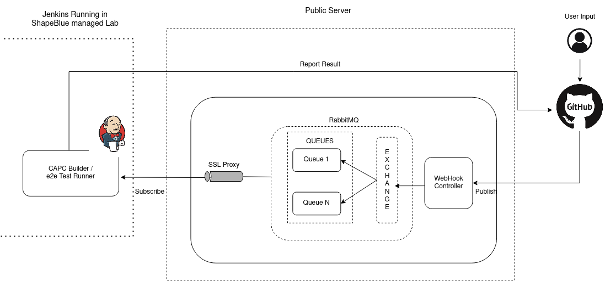
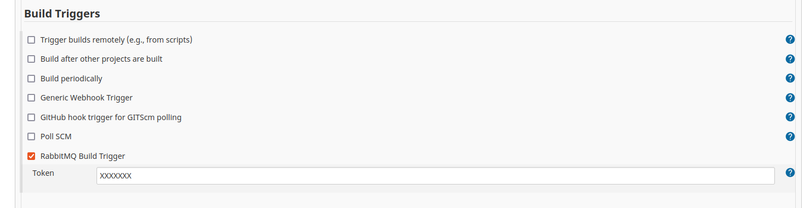
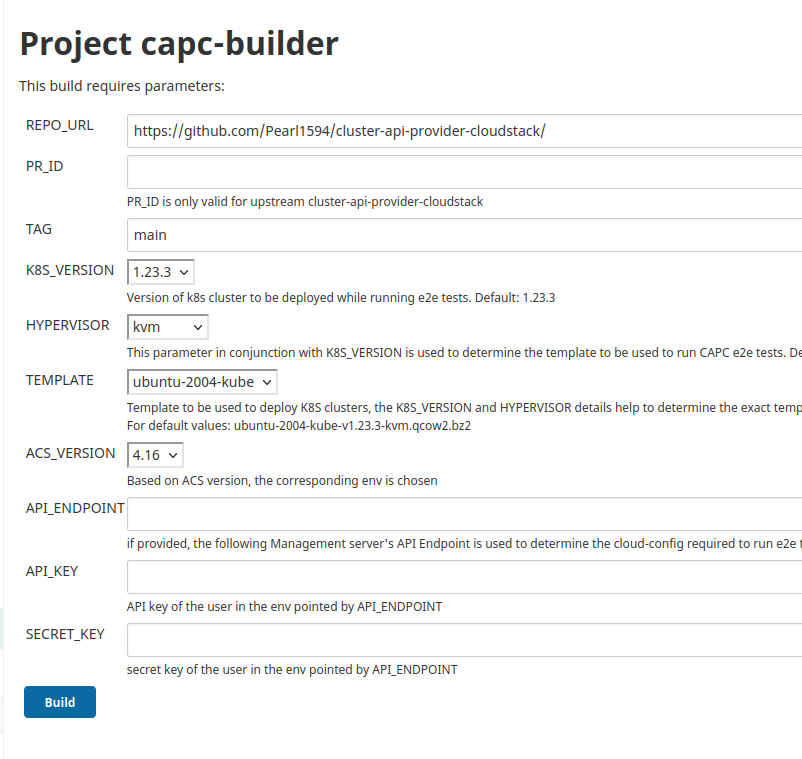

# webhook-controller

Following is the design plan for integrating repository level webhooks to work in tandem with Jenkins to run specific jobs. Below is an example for CAPC repository:



#### GitHub Repository Webhook
The github repository, here  https://github.com/kubernetes-sigs/cluster-api-provider-cloudstack  will have a webhook registered at the http://<server_name>/webhook endpoint. While registering the webhook, one would need to subscribe to the right events which will then be evaluated by the webhook controller to trigger the jobs. For example, in this specific case, for cluster-api-provider-cloudstack we have subscribed to pull-request and pull request review comment requests, so that the commands provided can be processed on need basis.

#### Webhook controller and Message broker

The webhook controller running on a public server keeps listening for specific events that have been subscribed to. A map comprising of commands undestood by the controller is maintained, that is referred to, to validate if the incoming PR comment is a valid command. If yes, it evaluates the args passed and then prepares the payload in a format that when published to the message broker, here, RabbitMQ can be understood by Jenkins that's listening / consuming messages from the exchange.

The Message broker is TLS enabled to ensure that no malicious data is forwarded to Jenkins. To facilite security, a SSL Reverse proxy is placed between the message broker and jenkins.

The controller processes the webhook event payload for the  subscribed events and evaluates what operation needs to be performed: 

- New PR / PR transitions from closed to open:
    -   prints a comment on the PR explaining the valid commands that can be run for the specific repo, e.g., 
     `/run-e2e `  - would trigger the run of the e2e test run job on Jenkins 
    - When specific comments are provided on the PR like  `/run-e2e ` then it will publish a message to RabbitMQ exchange with the following info: 
        - Repo name 
        - PR
        - any further args (if supported / applicable)

##### Jenkins

Jenkins is configured with **_RabbitMQ Build Trigger_** and **_RabbitMQ Consumer_** Plugins. It is configured to subscribe to the specific queues. Necessary jenkins jobs need to be created that a configured to be trigerred when a message is published to the subscribed queue. For example, a capc-builder job is created to handle the run of e2e tests for a given PR. The job is configured with a build trigger: 



Once the job completes the result of the test run will directly be publised on to the PR with it's log files attached as a zip file. 



For CAPC e2e tests, the jenkins job is configured as follows:

When a user runs  `/run-e2e `, it will run with the configured defaults on the given PR, for example: 
- K8S version: 1.23.3 
- Hypervisor: KVM 
- Template: ubuntu-2004-kube-v1.23.3-kvm.qcow2.bz2
- ACS version: 4.16 


The assumption is that we will have 3  mixed environments available for the ACS versions currently supported: 4.14, 4.16, 4.17. Mixed environments imply that there are hosts of all supported hypervisor types: KVM, VMware, XenServer. And based on the command passed, we can run it on the specific env for more flexibility:
 
 `/run-e2e <K8s version> <hypervisor> <ACS_version> `
 

The pre-existing enviroments will have the required CAPC templates registered and the required service offerings will be pre-created. 


#### WebHook Controller Usage
This controller connects is registered as a repository level webhook against respective repos. A constant set of commands are maintained for each repository. Data such as github access tokens, message broker endpoint , username and password are exported as env variables

```
GITHUB_ACCESS_TOKEN="XXXXXXXXXXXXXXXXXXXXX"
GITHUB_WEBHOOK_SECRET="XXXXXXXX"
RABBITMQ_USERNAME="admin"
RABBITMQ_PASSWORD="password"
RABBITMQ_ENDPOINT="qa.cloudstack.cloud:5672"
```
